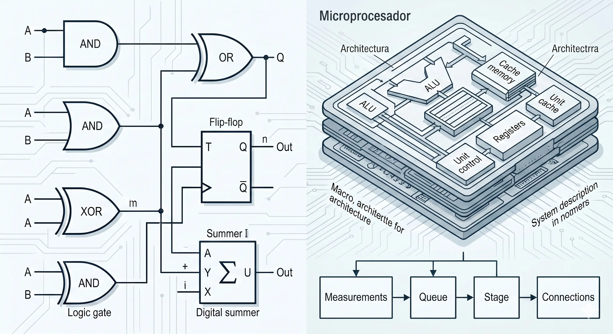
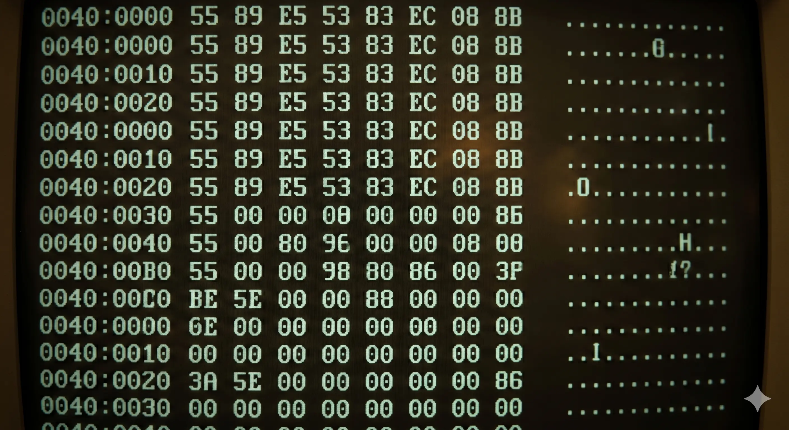
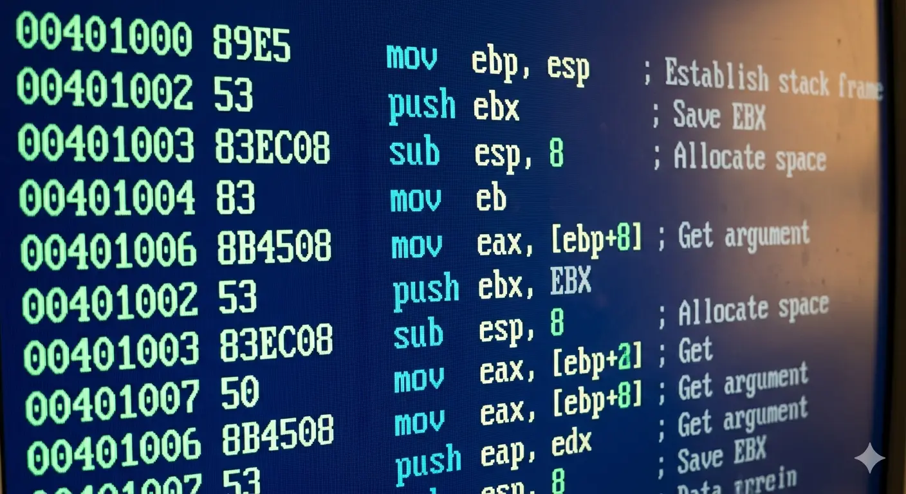
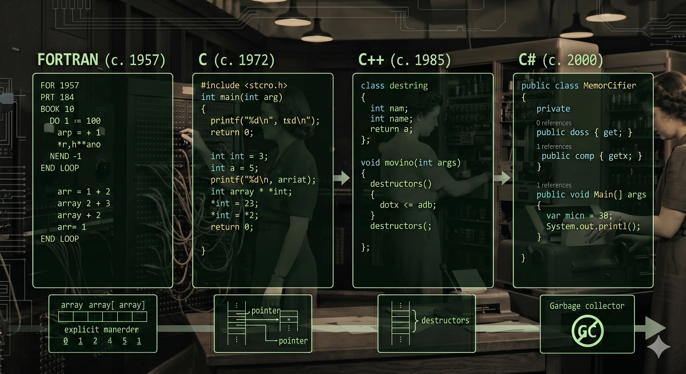
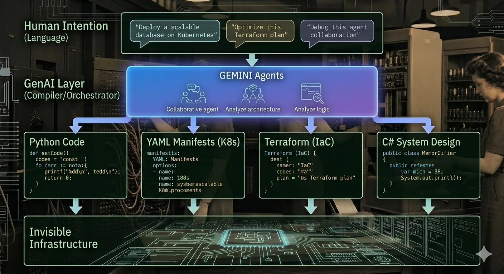

### Un recorrido histórico de la abstracción en software, del Assembler a la IA generativa, y cómo construí una célula de agentes bajo Clean Architecture y TDD para probarlo.

*por Camilo — Junio 15 2026 · [LinkedIn](https://www.linkedin.com/in/ernestocamilovera/)*
## Introducción: De la Práctica Corporativa a la Memoria Colectiva

Últimamente estuve trabajando de manera más intensa y sistemática con las nuevas herramientas de IA. Luego de una serie de cursos mandatorios que tuve que hacer en la empresa en la que trabajo, comencé a utilizar Gemini para desarrollo. En mi caso, decidí hacer un proyecto para "aprender haciendo" (*learn by doing*), que es una de las formas en las que a mí mejor se me da aprender algo nuevo. 

Ese proyecto es un módulo de Node.js, que fue la "excusa" que pensé para desarrollar un sistema de agentes que colaboran entre sí para construir software. Mientras avanzaba en esta Prueba de Concepto (POC - *Proof of Concept*), se me vino a la memoria un concepto que le escuché nombrar alguna vez al gran **Ángel "Java" López**. Para los que peinan canas como yo (guiño, guiño, jeje), estoy seguro de que alguna vez lo escucharon nombrar; y para los que no, les cuento que fue un gran desarrollador de software, brillante y muy activo en la comunidad de profesionales de la industria del software en Argentina y Latinoamérica. 

El concepto que se me apareció de golpe fue el de **"Raise the level of abstraction"** (Elevar el nivel de abstracción). Y ahora les paso a comentar un poco de historia (para todos conocida, seguramente) que quiero "refrescar" para que nos ayude a pensar un poco el presente (¿y el futuro?) del desarrollador de software, del *technical architect* y el uso de herramientas de GenAI.

---

## El Hilo Histórico de la Abstracción

### Los Albores de la Computación y el Nivel Físico
En los inicios, programar requería una comprensión absoluta del hardware subyacente. Las computadoras pioneras se configuraban de manera puramente física y mecánica.

A este nivel, la innovación estaba severamente limitada por la capacidad cognitiva humana para gestionar la complejidad de los componentes físicos directos.

### El Código Máquina y el Nacimiento del Assembler
El procesador solo entiende bits. Originalmente, los programas se escribían en secuencias puras de unos y ceros (código máquina), lo que hacía casi imposible levantar la vista del detalle para pensar en el diseño general del sistema.

Para aliviar esta carga, los científicos de la computación crearon los lenguajes de ensamblaje (*Assembly*). Por primera vez, se introdujo una representación simbólica (mnemónicos como `MOV` o `ADD`) que un programa llamado "ensamblador" traducía al lenguaje nativo del chip. Había nacido la primera gran capa de abstracción.

### Los Lenguajes de Alto Nivel y la Revolución del Compilador
A mediados de la década de 1950, John Backus y su equipo en IBM revolucionaron la industria con **FORTRAN** (Formula Translator). Esto permitió a los programadores expresar intenciones matemáticas complejas de forma directa (como `c = a + b`), delegando en un "compilador" la tarea de generar las instrucciones primitivas de la máquina. 

Con el tiempo, lenguajes como **C, C++ y C#** operaron a niveles progresivamente más altos, aislando los conceptos de negocio de la infraestructura del hardware. Como bien señala Bjarne Stroustrup (creador de C++): *"Queremos lidiar con los problemas al mismo nivel en el que pensamos esos problemas. Cuando hacemos eso, no hay una brecha entre la forma en que entendemos los problemas y la forma en que implementamos sus soluciones. No tenemos que ser el compilador."*

---

### El Presente y el Futuro: GenAI como la Nueva Capa de Abstracción

Hoy nos encontramos ante un cambio de paradigma idéntico al paso del Assembler a los lenguajes estructurados. Las herramientas de Inteligencia Artificial Generativa y los sistemas de agentes autónomos están asumiendo el rol de **un nuevo compilador moderno**.

La IA generativa rompe la barrera de la sintaxis rígida al permitirnos interactuar mediante el lenguaje natural. El humano ya no actúa como el transcriptor de reglas gramaticales para la máquina, sino como el **diseñador del sistema y el validador de la arquitectura**. El código tradicional pasa a ser un *output* automatizado.

No obstante, como ingenieros de software y arquitectos técnicos, nos enfrentamos a una distinción crítica en este nuevo escenario, que a su vez abre la puerta para dar un salto evolutivo aún mayor:

1. **Generación Probabilística (IA):** Es extremadamente rápida, flexible y creativa para traducir intenciones abstractas desde el lenguaje natural, pero es intrínsecamente probabilística. Ante un mismo *prompt*, la IA puede entregarnos una implementación de código estructuralmente distinta cada vez.
2. **Generación Determinista (Modelos de Sistema):** Es explícita, predecible y repetible. Al basarse en modelos formales de arquitectura o datos, produce exactamente el mismo cableado de infraestructura y componentes en cada ejecución. Esto es indispensable para sistemas de larga vida que requieren ser auditables, estables y analizables en el tiempo.

**El verdadero quiebre de paradigma:** Esta distinción no significa que debamos elegir entre una u otra. El verdadero salto de abstracción ocurre cuando combinamos ambas fuerzas bajo el principio irrenunciable del **humano en el centro del control (Human-in-the-Loop)**. El quiebre está en que **el ingeniero diseña, construye y mantiene herramientas de Generación de Código Determinista, utilizando a la IA Generativa como un par, un asistente intelectual avanzado**. En lugar de pedirle a la IA que tire líneas de código directas a producción de manera aleatoria, el humano eleva su propio rol un nivel más arriba: se apoya en la IA como un copiloto estratégico para acelerar el diseño de los modelos formales, estructurar los templates de infraestructura y refinar los compiladores específicos que luego garantizarán una salida determinista, controlada y predecible.

### El Verdadero Objetivo del Rol Técnico
Elevar el nivel de abstracción con GenAI no significa el fin de la ingeniería de software; significa su evolución hacia el **Pensamiento de Sistemas (*Systems Thinking*)**. Al automatizar el entramado mecánico del código rutinario, el foco se desplaza por completo hacia la ingeniería de requerimientos, el diseño de la resiliencia arquitectónica y la inspección meticulosa de las interacciones del sistema. 

El código tradicional no se vuelve invisible ni se ignora; pasa a ser un artefacto derivado y automatizado bajo estricto control de ingeniería, de la misma manera que el código máquina queda abstraído cuando escribimos una aplicación en Node.js o configuramos un pipeline de infraestructura en la nube. El foco técnico no se diluye, sino que se eleva al nivel del diseño conceptual y arquitectónico, donde verdaderamente se resuelven los problemas de fondo.

---

## Operando en el Siguiente Nivel: Frameworks de Agentes y Nuevos Flujos de Trabajo

Para entender el impacto real de este nuevo nivel de abstracción, no basta con mirar las herramientas aisladas; es necesario observar cómo está cambiando la práctica diaria de quienes moldean nuestra industria. Recientemente, el analista Gergely Orosz (*The Pragmatic Engineer*) entrevistó a dos figuras icónicas que representan los dos extremos del espectro del desarrollo de software: **Anders Hejlsberg**, el legendario diseñador de lenguajes detrás de Turbo Pascal, Delphi, C# y TypeScript; y **David Heinemeier Hansson (DHH)**, el creador de Ruby on Rails y ferviente defensor del pragmatismo en el desarrollo de productos.

Viniendo de escuelas de pensamiento tan distintas, sus visiones del 2026 convergen en un punto de quiebre absoluto: **el flujo de trabajo tradicional donde un desarrollador pasa horas picando código línea por línea está oficialmente obsoleto**. 

Por un lado, DHH describe un salto radical hacia un flujo de trabajo **"Agent-First"** (Agente Primero). Confiesa que ha dejado de escribir la gran mayoría del código a mano para operar en un "Modo Centauro", donde él lidera la estrategia y delega la ejecución mecánica a agentes autónomos en la terminal. DHH introduce un concepto fundamental para los arquitectos actuales: a medida que la IA democratiza la escritura de sintaxis, la ventaja competitiva del ingeniero senior ya no radica en su velocidad para tipear, sino en su **criterio, su gusto, su sentido de la estética y sus implacables estándares de calidad**.

Por el otro lado, Anders Hejlsberg valida este cambio desde la perspectiva del creador de herramientas. Alguien que dedicó su vida a construir compiladores tradicionales observa hoy que la IA actúa como el nuevo intérprete de la intención humana. Sin embargo, Anders aporta una claridad técnica indispensable: la IA no hace que los lenguajes formales desaparezcan; al contrario, los sistemas de tipado estricto y los compiladores que él ayudó a diseñar son hoy los "guardarraíles" matemáticos que permiten a la IA validar si lo que generó de forma probabilística es correcto y coherente.

A esta conversación sobre la redefinición de los flujos de trabajo se suma la perspectiva fundamental de Martin Fowler, quien coincide en que nos encontramos ante la transformación más profunda de la industria desde la histórica transición del lenguaje ensamblador a los primeros lenguajes de alto nivel como FORTRAN. Sin embargo, Fowler introduce una advertencia crucial para el rol técnico actual: el cambio medular con las LLMs no reside principalmente en un incremento en el nivel de abstracción formal, sino en el paso drástico de un paradigma puramente determinista a uno completamente no-determinista. Esta naturaleza probabilística desarma el concepto tradicional de la artesanía del software si se cae en el extremo del vibe coding descontrolado. Según Fowler, prescindir de la revisión del código generado rompe el bucle de aprendizaje técnico elemental. El código resultante adopta estructuras tan enrevesadas y caóticas que ante la menor necesidad de ajuste fino, el desarrollador pierde la capacidad de refactorizar de forma incremental, viéndose forzado a destruir la solución por completo para volver a empezar desde cero. El verdadero desafío de la ingeniería moderna no es programar a ciegas, sino domar ese no-determinismo mediante un riguroso andamiaje de pruebas automatizadas y un diseño consciente de las abstracciones.

### La Transición del Ecosistema: De Oráculos a 'Pares' (¿?)
Esta convergencia entre Hejlsberg y DHH nos muestra el verdadero mapa del *State of the Art*: dejamos atrás la era de los plugins de chat básicos —donde usábamos a la IA como un "oráculo" para copiar y pegar fragmentos aislados— y entramos de lleno en la era de los **Flujos de Trabajo Agénticos (*Agentic Workflows*)**. 

Aquí es donde el diseño de software y la ingeniería de plataformas se encuentran operando en el siguiente nivel. Hoy, el trabajo real se divide entre:
1. Diseñar e implementar las arquitecturas donde correrán estos sistemas de agentes en producción (utilizando frameworks de backend como **LangChain** o **LangGraph**).
2. Liderar la orquestación del desarrollo desde entornos de desarrollo nativos de IA (como **Antigravity**), donde el ingeniero actúa como un revisor premium y director del sistema.

### Cuatro Patrones de Diseño Agénticos

Para entender cómo operan estos nuevos flujos de trabajo sin caer en el *hype*, es fundamental revisar la teoría de ingeniería que los sustenta. Andrew Ng y el equipo de investigadores de *DeepLearning.AI* formalizaron que el verdadero salto en el rendimiento de la IA generativa no viene de agrandar los modelos, sino de implementar **Patrones de Diseño Agénticos (*Agentic Design Patterns*)**. 

Cuando dejamos de usar un LLM en modo *Zero-Shot* (una única pregunta y una única respuesta esperada) y lo obligamos a iterar a través de un flujo de trabajo, los resultados en tareas complejas como la programación se disparan. Esta teoría se divide en cuatro pilares fundamentales:

* **Reflexión (*Reflection*):** En lugar de aceptar el primer código que genera el modelo, se implementa un bucle donde el agente evalúa su propia salida de forma crítica. Un agente genera el código y otro (o el mismo en un segundo paso) actúa como revisor, buscando *bugs*, ineficiencias o fallas de arquitectura, refinando el resultado de manera autónoma antes de entregarlo.
* **Uso de Herramientas (*Tool Use*):** Los LLMs por sí solos no saben calcular con precisión matemática ni pueden validar si un código compila. Este patrón dota al agente de la capacidad de reconocer cuándo necesita ayuda externa y ejecutar herramientas reales: calculadoras, intérpretes de código, linters, APIs o terminales de ejecución. El agente ya no solo "piensa" de forma probabilística; opera de forma determinista sobre el entorno.
* **Planificación (*Planning*):** Ante un requerimiento grande (como *"escribí un módulo completo de Node.js"*), un humano no empieza a tipear todo de corrido; primero planifica. Este patrón obliga al agente a descomponer una meta macro en una secuencia detallada de sub-pasos, prever dependencias y decidir el orden de ejecución antes de tocar una sola línea de código.
* **Colaboración Multi-Agente (*Multi-Agent Collaboration*):** El límite de un solo agente con un *prompt* gigantesco es la satisfacción de su contexto. La solución de ingeniería es la división del trabajo: fragmentar el problema entre múltiples agentes especializados donde cada uno tiene un rol explícito (por ejemplo, un Arquitecto, un Programador y un Tester). Estos agentes conversan entre sí, se delegan subtareas y debaten la mejor solución, emulando la dinámica de un equipo de desarrollo de alto rendimiento.

---

## Estructuras Organizacionales de la IA: Patrones Arquitectónicos de Industria

Para llevar la teoría de los agentes a la práctica corporativa, la industria de la ingeniería de software ha comenzado a consolidar patrones arquitectónicos repetibles. Ya no se trata de lanzar instrucciones aisladas a un modelo, sino de diseñar sistemas socio-técnicos donde múltiples agentes de IA operan bajo topologías y reglas estrictas, emulando las metodologías de los equipos de desarrollo de alto rendimiento.

A continuación, se describen tres patrones de diseño emergentes que están definiendo el estado del arte en la construcción de software asistido por IA:

### 1. El Patrón "Orquesta de Ingeniería" (Hierarchical Agent Teams)

MetaGPT: Este framework multi-agente destaca precisamente por inyectar metodologías operativas estandarizadas (SOPs) de la industria. Permite coordinar de forma jerárquica un equipo virtual compuesto por Product Managers, Architects (quienes diseñan contratos e interfaces antes de codificar) e Engineers.

Enlace al repositorio: [GitHub - MetaGPT](https://github.com/FoundationAgents/MetaGPT)

ChatDev: El proyecto de referencia para simular una "empresa virtual de software". En este entorno, agentes con roles definidos (CEO, CTO, Programmer, Tester) colaboran de manera interactiva a través de seminarios funcionales para escribir, revisar y validar el código en un bucle colaborativo.

Enlace al repositorio: [GitHub - ChatDev](https://github.com/OpenBMB/ChatDev)

### 2. Inyección de Blueprints Centralizados (Centralized Tooling Injection)

LangGraph (Ecosistema LangChain): Es el estándar de la industria para definir flujos de agentes cíclicos y deterministas basados en grafos. Permite estructurar e inyectar configuraciones de control estables, asegurando que los agentes sigan caminos de ejecución predecibles y alineados a estándares organizacionales.

Enlace al repositorio: [LangGraph - Agentic Workflows](https://github.com/langchain-ai/langgraph)

Microsoft AutoGen: Biblioteca pionera para la automatización e interconexión de sistemas multi-agente conversacionales. Su arquitectura permite definir agentes configurados de manera determinista mediante plantillas y archivos locales de reglas para resolver flujos complejos de ingeniería.

Enlace al repositorio: [GitHub - Microsoft AutoGen](https://github.com/microsoft/autogen)

### 3. Ciclos de Vida Automatizados y Ejecución en Bucle Cerrado (REPL Agéntico)

Aider (AI Pair Programming Tool): Una herramienta agéntica por línea de comandos ampliamente respetada por desarrolladores senior. Se conecta directamente a repositorios Git locales, genera mapas de símbolos de la base de código (Repository Map), edita archivos en paralelo, realiza los commits automáticamente y ejecuta pruebas o linters en la terminal nativa para auto-corregirse si detecta errores.

Enlace al repositorio: [GitHub - Aider](https://github.com/Aider-AI/aider)

Claude Code / Anthropic Tools: Las guías y documentación de Anthropic sobre capacidades de ejecución de código y herramientas de desarrollo agéntico (Tool use). En ellas se detalla formalmente cómo los agentes avanzados utilizan herramientas de sistema (Bash tools, Text editor tools) para interactuar con entornos locales en bucles cerrados de desarrollo, leyendo los logs de error de la consola para refinar su salida de manera autónoma.

Enlace a la documentación: [Anthropic - Claude API Documentation (Tool use)](https://docs.anthropic.com/en/docs/tool-use)

---

## De la Teoría a la Trinchera: El Nacimiento de json-mapper

Para entender cómo se entrelazan estos patrones arquitectónicos en la práctica, es necesario descender de la abstracción académica y observar la realidad de la trinchera técnica. Como mencioné al inicio, mi exploración con la Inteligencia Artificial Generativa no comenzó con sistemas complejos, sino con una necesidad mundana y cotidiana: configurar un entorno de desarrollo local.

Al igual que la gran mayoría de los ingenieros de software actuales, mi primer punto de contacto con estas tecnologías consistió en integrar los modelos de Gemini dentro de editores tradicionales mediante extensiones oficiales o conectores de API REST a través de Google AI Studio. En ese estadio inicial, el flujo de trabajo seguía respondiendo al paradigma lineal clásico: la IA operaba como un "autocompletar avanzado" en línea, ofreciendo bloques de sugerencias en gris que el desarrollador aceptaba con un tabulador, o como un panel de chat lateral al que se le hacían consultas aisladas en modo *zero-shot*.

Pronto, los límites de este enfoque se hicieron evidentes. Si bien la velocidad para generar funciones aisladas o estructuras repetitivas (*boilerplate*) aumentaba de forma no-trivial, el ingeniero seguía atrapado en el rol de "compilador manual": copiando fragmentos, resolviendo manualmente los errores sintácticos en la terminal local, gestionando el contexto del repositorio a fuerza de prompts kilométricos y asumiendo la carga cognitiva de mantener la coherencia arquitectónica del sistema. No estábamos elevando el nivel de abstracción; solo estábamos tipeando más rápido.

El verdadero salto evolutivo ocurrió cuando decidí utilizar el desarrollo de un módulo real de Node.js —un CLI utilitario de mapeo y transformación de estructuras de datos denominado `json-mapper`— como el laboratorio experimental para implementar una estrategia de desarrollo **Agent-First**.

Para resolver este desafío de ingeniería bajo estándares corporativos, el entorno de trabajo se mudó de los editores tradicionales hacia un espacio de trabajo nativo de IA (Antigravity IDE), y la interacción individual mutó hacia una célula de ingeniería compuesta por agentes especializados y coordinados bajo el patrón de la "Orquesta de Ingeniería". El objetivo ya no era pedirle a una IA que escribiera el mapeador; el objetivo era guiar a un equipo autónomo para que diseñara las interfaces, implementara la lógica y validara la integridad del módulo en un bucle cerrado determinista.

### La Célula de Ingeniería Virtual: Configuración y Roles

Para que el desarrollo de `json-mapper` no cayera en un ejercicio desordenado de *vibe coding*, la arquitectura agéntica se estructuró bajo la filosofía de **Configuration-as-Code**. En lugar de interactuar con una ventana de chat mediante instrucciones volátiles, las directrices, responsabilidades, restricciones técnicas y la bibliografía académica de ingeniería se consolidaron en planos de configuración estables dentro del propio espacio de trabajo.

Este enfoque descentralizado permitió crear un repositorio de blueprints de ingeniería reutilizables que gobiernan las instancias locales de los agentes de manera determinista. Para la construcción del mapeador de JSON, la célula virtual se dividió en tres roles con fronteras operativas estrictas:

#### 1. El Arquitecto Técnico (Lead Architect)
Este agente actúa como el guardián de la base de código. No escribe líneas de código rutinario; su función exclusiva es procesar los requerimientos del usuario, diseñar las interfaces de abstracción y realizar la auditoría de calidad cruzada (*Code Review*). Su razonamiento y toma de decisiones se anclaron explícitamente en tres fuentes fundamentales de la industria:
* **Clean Architecture:** Para imponer la regla de dependencia interna, asegurando que las políticas comerciales centrales de transformación de datos estén completamente aisladas de los mecanismos periféricos de entrada/salida de archivos o CLI.
* **Principios S.O.L.I.D.:** Especialmente el principio de Inversión de Dependencias (DIP) y de Responsabilidad Única (SRP) para regular cómo interactúan los módulos de la aplicación.
* **Design Patterns:** Para estandarizar soluciones estructurales, favoreciendo la composición sobre la herencia e identificando patrones específicos (como *Strategy* o *Adapter*) para resolver mutaciones complejas de esquemas.

#### 2. El Ingeniero Full-Stack (Execution Layer)
Ubicado en el nivel operativo dentro del sandbox persistente provisto por el entorno de desarrollo agéntico, este subagente traduce las especificaciones de diseño en código fuente de producción. Su comportamiento está rígidamente regido por:
* **Test-Driven Development:** Ejecutando un bucle cerrado estricto de *Red-Green-Refactor*. El agente escribe primero una prueba unitaria fallida, codifica la solución mínima para que pase y finalmente limpia la sintaxis, validando la integridad técnica en la terminal interna antes de entregar la tarea.
* **Patrones de JavaScript Moderno:** Utilizando estructuras modulares y limpias de acoplamiento.
* **Mecánica Avanzada de Runtimes:** Para domar el motor de Node.js mediante el uso optimizado de clausuras (*closures*), contextos de ejecución y reducción eficiente para resolver accesos profundos de propiedades en objetos anidados.

#### 3. El Redactor Técnico (Technical Writer)
Un especialista dedicado exclusivamente a la capa de documentación humana. Su perfil está gobernado por el **Framework Diátaxis** y los estándares *Docs-as-Code* de GitHub, eliminando verbos de relleno o mercadotecnia ("fácilmente", "simplemente") para construir guías de instalación, diagnósticos copiables y manuales de abordaje rápido.

### La Barrera de Dominio: El Flujo Operativo Cíclico

El verdadero poder de esta topología jerárquica no reside en la genialidad de sus componentes aislados, sino en la interacción regulada por el protocolo del entorno. Para evitar que la lógica del mapeador se mezclara de forma accidental con las librerías del sistema operativo, el flujo se diseñó en fases secuenciales:

[Idea de Negocio] ──► [Lead Architect: Fase de Dominio] ──► Especificación de Dominio
│
▼
[Aprobación Humana] ◄── [Lead Architect: Diseño Técnico] ◄── Plan de Arquitectura
│
▼
[Subagente Full-Stack] ──► [Bucle Cerrado TDD (Red-Green-Refactor)] ──► [Tests Pass]
│
▼
[Auditoría de Calidad del Arquitecto] ──► [Entrega Controlada]

1. **Fase de Dominio Puro (Functional Domain Assessment):** Ante un requerimiento, el Arquitecto modela el problema de forma agnóstica como un puro algoritmo matemático. Define los esquemas contractuales y las reglas de transformación recursiva ante rutas con notación de punto (ej. `propiedad3.propiedad3_1`), ignorando por completo comandos de terminal, argumentos CLI o la librería `fs` de Node.js.
2. **Fase de Diseño Técnico (Technical Specification):** El Arquitecto toma las reglas puras del dominio y diseña la arquitectura física del software bajo el principio de menor privilegio, definiendo la estructura de capas y contratos lógicos del sistema.
3. **Fase de Ejecución Determinista (TDD Sandbox Loop):** Una vez aprobado el plan por el humano en el centro del control (*Human-in-the-Loop*), se invoca dinámicamente al subagente Full-Stack. Este se encierra en la terminal del sandbox, inicializa el proyecto, escribe los tests, levanta el test runner y no sale del ciclo hasta que la suite de pruebas unitarias pasa al 100%.
4. **Fase de Control de Calidad:** El ejecutor se apaga y el Arquitecto Técnico despierta de nuevo para auditar el diff de código generado antes de presentárselo al usuario, asegurando que ninguna dependencia de infraestructura haya contaminado el núcleo del negocio.

### La Trinchera de la Versión 2: Integración, Telemetría y Desafíos de Entorno

El verdadero examen para nuestra célula de ingeniería virtual ocurrió durante la transición de `json-mapper` hacia su Versión 2. El desafío ya no era escribir algoritmos aislados en Vanilla JS, sino evolucionar el sistema integrando módulos del ecosistema de producción de Node.js —específicamente `commander` para la gestión de comandos por consola y `pino` para el registro de logs estructurados— sin corromper los límites limpios de nuestra arquitectura.

Siguiendo el flujo regulado, el Arquitecto diseñó la estrategia de integración aplicando de forma estricta el principio de Inversión de Dependencias (DIP). En lugar de permitir que el ejecutor inyectara la librería de logs de forma directa en el núcleo de transformación, definió una interfaz abstracta o puerto dentro de la capa de Casos de Uso. En la periferia de la infraestructura, se construyó un adaptador específico encargado de traducir las llamadas abstractas del sistema a la estructura de JSON nativa de Pino. Con este desacoplamiento, si en el futuro se decide sustituir Pino por cualquier otra solución, el núcleo comercial del mapeador permanecerá 100% intacto.

Una vez validada la especificación, el programador Full-Stack profesional asumió el control del sandbox de ejecución mediante ciclos rigurosos de TDD. Para medir métricas críticas de rendimiento —como el tiempo total de ejecución calculado con microsegundos mediante `performance.now()` y el conteo exacto de registros transformados—, el agente prescindió de frameworks externos de simulación, modelando stubs limpios directamente en el entorno de pruebas y verificando de forma determinista la salida técnica en la terminal interna.

No obstante, esta experiencia en la trinchera agéntica también desveló las fricciones operativas reales que ocurren cuando se trabaja con herramientas probabilísticas sobre sistemas de archivos físicos. Durante el sprint, el entorno se enfrentó al clásico dolor de cabeza de Git: la carpeta `node_modules/` seguía siendo rastreada y expuesta en el panel de control a pesar de figurar explícitamente dentro del archivo `.gitignore`. Tras varios intentos fallidos de limpieza de caché indexada, la auditoría interna de los agentes descubrió el verdadero origen del fallo, un sutil error de entorno que a menudo confunde a desarrolladores seniors humanos: el archivo `.gitignore` había sido creado en un notebook de Windows mediante comandos de redirección de PowerShell que forzaron una codificación en **UTF-16LE**. Dado que Git requiere estrictamente codificaciones en **UTF-8** para procesar los patrones de exclusión, interpretaba el archivo como un bloque binario corrupto e ignoraba las reglas. La resolución del bug —reescribir el archivo en UTF-8 nativo— devolvió la limpieza al workspace, permitiendo que la suite completa de pruebas unitarias y de integración pasara limpiamente y se consolidara el release en GitHub.

---

## Conclusión: El Futuro del Ingeniero de Sistemas en la Era Agéntica

Elevar el nivel de abstracción mediante el uso de Inteligencia Artificial Generativa y entornos agénticos no representa la automatización del ingenio humano, sino la liberación de su verdadero potencial. Al delegar la micro-sintaxis rígida, el cableado repetitivo de infraestructura y la corrección de errores triviales de la terminal a una célula virtual jerárquica y determinista, el rol del desarrollador no desaparece; se transforma profundamente. Pasamos de ser transcriptores de código a diseñadores de intenciones lógicas, guardianes de la Clean Architecture y arquitectos de sistemas complejos orientados al pensamiento de sistemas (*Systems Thinking*). 

La clave de este cambio de paradigma es comprender que la IA no es un reemplazo de la artesanía del software, sino un multiplicador intelectual. El control, los estándares de calidad y la responsabilidad de la coherencia técnica siguen estando bajo el dominio irrenunciable del humano en el centro del control (*Human-in-the-Loop*). Al domar el no-determinismo probabilístico de los modelos con guardarraíles matemáticos, suites de pruebas rigurosas y una sólida base de principios de diseño tradicionales, la ingeniería de software evoluciona hacia una disciplina mucho más estratégica, abstracta y creativa.

---

Si te interesa profundizar en los detalles técnicos de esta implementación o explorar de primera mano cómo interactúa este flujo agéntico, podés acceder al repositorio público del proyecto:

👉 **[GitHub - json-mapper](https://github.com/chamix/json-mapper)**

*Nota del autor: Si bien este módulo nació como una Prueba de Concepto (POC) artesanal bajo la premisa de "aprender haciendo" (learn by doing), el repositorio es completamente abierto. Te invito a clonarlo, auditar sus capas de abstracción e incluso evolucionar tu propia versión si querés llevar este laboratorio experimental al siguiente nivel.*

---

## Fuentes de Referencia

* **Shih, Willy C. / Harvard Business School.** *Increasing the Level of Abstraction as a Strategy for Accelerating the Adoption of Complex Technologies*. Strategy Science 6, no. 1 (2021): 54–61. [Texto completo en PDF - HBS](https://www.hbs.edu/ris/Publication%20Files/Increasing%20the%20level%20of%20abstraction_ca0a5b9b-cec7-482c-95ca-b56e5c5a9d67.pdf)
* **Stroustrup, Bjarne.** *Abstraction and Efficiency*. Entrevista por Bill Venners para Artima. [Artima - Abstraction and Efficiency](https://www.artima.com/articles/abstraction-and-efficiency)
* **Wilson, Mark.** *Why UML is a Bad Abstraction Mechanism* y *Many Systems Are Built at the Wrong Level of Abstraction*. Markv Tech Blog. ["Why UML is a Bad Abstraction Mechanism"](https://www.markv.com/blog/why-uml-is-a-bad-abstraction-mechanism) | ["Many Systems Are Built at the Wrong Level of Abstraction"](https://www.markv.com/blog/many-systems-are-built-at-the-wrong-level-of-abstraction)
* **Garros, Damien.** *AI Is the New Compiler*. OpsMill Blog. [OpsMill - AI Is the New Compiler](https://www.opsmill.com/blog/ai-is-the-new-compiler/)
* **López, Ángel "Java".** *Raise the Level of Abstraction (Part 1: Introduction)*. [Ángel "Java" López - Blog Histórico](https://ajlopez.wordpress.com/2011/06/03/raise-the-level-of-abstraction-part-1-introduction/)
* **Ng, Andrew / DeepLearning.AI.** *Agentic Design Patterns (The Batch technical series)*. [DeepLearning.AI - How Agents Can Improve LLM Performance](https://www.deeplearning.ai/the-batch/how-agents-can-improve-llm-performance/)
* **Fowler, Martin.** *How AI will change software engineering*. Entrevista por Gergely Orosz para *The Pragmatic Engineer Podcast*.
* **MetaGPT.** *Framework multi-agente jerárquico basado en Procedimientos Operativos Estándar (SOPs)*. [GitHub - MetaGPT](https://github.com/franztao/MetaGPT).
* **ChatDev.** *Entorno de desarrollo de software virtual basado en comunicación multi-agente colaborativa*. [GitHub - ChatDev](https://github.com/openbmb/ChatDev).
* **LangGraph (Ecosistema LangChain).** *Documentación de flujos de trabajo cíclicos y sistemas agénticos basados en grafos*. [LangGraph - Agentic Workflows](https://langchain-ai.github.io/langgraph/).
* **Microsoft AutoGen.** *Ecosistema e infraestructura para la automatización de conversaciones multi-agente deterministas*. [GitHub - Microsoft AutoGen](https://github.com/microsoft/autogen).
* **Aider.** *Herramienta agéntica de programación en pareja por línea de comandos y mapeo de espacios de trabajo locales (Repository Map)*. [GitHub - Aider](https://github.com/paul-gauthier/aider).
* **Anthropic API.** *Documentación técnica sobre el uso de herramientas de sistema y ejecución local de agentes avanzados (Tool Use)*. [Anthropic - Claude API Documentation (Tool use)](https://platform.claude.com/docs/en/home).

