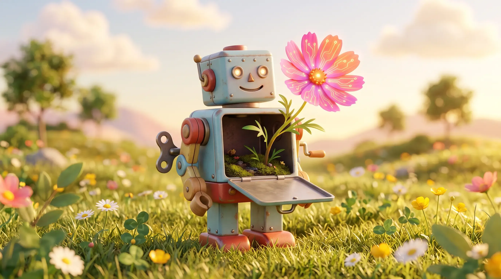

### 66 años de historia, dos inviernos de fracaso público y la convergencia final de cuatro piezas dispersas: cómo llegamos, en 2022, a una máquina que por fin supo conversar.

*por Camilo — Agosto 15 2026 · [LinkedIn](https://www.linkedin.com/in/ernestocamilovera/)*

---

Últimamente no hay reunión de trabajo que no termine mencionando "agentes", "tokens", "LLMs". Términos que manejamos con soltura —yo incluido— sin poder siempre explicar con precisión qué son ni cómo se relacionan entre sí. Se han vuelto vocabulario de oficina tan rápido que dimos por sentado que los entendíamos, cuando en realidad los estamos usando como sinónimos de algo mucho más amplio: "la IA", así, en singular y sin matices.

El problema es que "la IA" no es una cosa. Es un campo con 66 años de historia, dos fracasos públicos y sonoros, y una convergencia final de piezas que estuvieron dispersas durante décadas antes de encajar. Entender ese recorrido —de dónde viene cada palabra que usamos hoy— es lo que te permite, después, distinguir con precisión entre inteligencia artificial, machine learning, LLMs y las herramientas que armamos con ellos. Ese es el objetivo de esta serie. Empecemos por el principio.

## La palabra que se inventó en un verano de 1956

En el verano de 1956, un grupo pequeño de matemáticos e ingenieros se reunió en Dartmouth College, en New Hampshire, convocados por un joven profesor llamado John McCarthy. El objetivo declarado del encuentro —ocho semanas de trabajo, financiadas por la Fundación Rockefeller— era ambicioso hasta rozar lo temerario: explorar la idea de que cualquier aspecto del aprendizaje o de la inteligencia pudiera describirse con tanta precisión que una máquina lograra simularlo.

Ahí, en esa propuesta, se usó por primera vez el término "inteligencia artificial". No fue un hallazgo técnico puntual; fue una apuesta filosófica con nombre propio. McCarthy y sus colegas —entre ellos Marvin Minsky, Claude Shannon y Nathaniel Rochester— no tenían todavía las herramientas para cumplir esa promesa. Tampoco imaginaban cuánto tiempo iba a tomar.

Ese desfasaje entre la ambición del nombre y la capacidad real de la tecnología es, en más de un sentido, el patrón que se repite durante las siguientes seis décadas.

## Cuando el campo prometió de más, dos veces

La historia de la IA no es una línea ascendente. Es una historia de entusiasmo, promesa incumplida, y colapso de financiamiento — dos veces.

El primer episodio ocurrió a mediados de los años 70, cuando la Agencia de Proyectos de Investigación Avanzados de Defensa de Estados Unidos (DARPA, por sus siglas en inglés) retiró buena parte del financiamiento a la investigación general en IA, al no ver resultados militares concretos. Un informe británico crítico de la época, el llamado Informe Lighthill, terminó de sellar el desánimo. (Vale una aclaración honesta: entre historiadores del campo hay debate sobre si este "primer invierno" fue tan severo como se suele contar en retrospectiva, o si es una narrativa que se simplificó con el tiempo. El segundo episodio, en cambio, no admite discusión.)

Ese segundo invierno llegó a fines de los 80. La industria había apostado fuerte a los llamados "sistemas expertos" — programas que codificaban el conocimiento de un especialista humano en reglas del tipo "si pasa esto, entonces hacé aquello". Funcionaban, hasta que dejaban de funcionar: eran costosísimos de mantener, y una sola regla faltante podía romper el sistema entero. Cuando el hardware especializado que sostenía esa industria se volvió obsoleto frente a estaciones de trabajo genéricas mucho más baratas, el mercado colapsó casi de un día para el otro. Universidades enteras perdieron financiamiento. El término "inteligencia artificial" mismo cayó en desprestigio durante casi una década.

Es importante decir esto en voz alta: la IA no fue una marcha triunfal e ininterrumpida hacia el presente. Fue, dos veces, un campo que casi se extingue.

## El otro camino: aprender de los datos en vez de programar reglas

Mientras los sistemas expertos se derrumbaban, un enfoque distinto venía tomando forma en paralelo, casi silenciosamente. En vez de programar reglas explícitas para cada situación, ¿y si un sistema pudiera aprender esas reglas por sí mismo, a partir de ejemplos?

Ese enfoque —el aprendizaje automático, o *machine learning*— no es sinónimo de inteligencia artificial. Es un subconjunto de ella: una familia específica de técnicas dentro del campo más amplio que se inauguró en Dartmouth. Y dentro del machine learning hay, a su vez, un subconjunto más específico todavía: el *deep learning*, o aprendizaje profundo, que usa redes neuronales de múltiples capas inspiradas —de forma bastante libre— en la estructura del cerebro.

Esta relación de contención (IA contiene a ML, que contiene a deep learning) no es un detalle técnico menor. Es, probablemente, la fuente número uno de confusión en cualquier charla de oficina sobre el tema. Cuando alguien dice "la IA hizo esto", casi siempre se está refiriendo a un modelo de deep learning específico — no al campo entero.

El problema del deep learning, durante décadas, fue que la teoría existía pero le faltaban dos cosas: datos suficientes para aprender patrones complejos, y poder de cómputo suficiente para procesarlos en un tiempo razonable. Esa carencia se resolvió recién en 2012.

## Cuatro piezas que estaban dispersas

Ese año, un modelo llamado AlexNet ganó por una diferencia abrumadora una competencia de reconocimiento de imágenes llamada ImageNet. No ganó por poco: superó al segundo lugar por casi diez puntos porcentuales de precisión, algo inédito hasta ese momento. La clave no fue solo el diseño de la red neuronal, sino la combinación de dos factores que hasta entonces habían viajado por separado: un dataset masivo de imágenes etiquetadas y el uso de placas gráficas (GPUs) — hasta entonces pensadas para videojuegos, no para entrenar redes neuronales — para paralelizar el entrenamiento.

Ese fue el primer encastre. El segundo llegó cinco años después, y fue puramente arquitectónico. En 2017, un equipo de Google publicó un paper con un título casi provocador: *Attention Is All You Need*. Proponía una nueva forma de procesar secuencias de texto —el Transformer— que abandonaba el procesamiento palabra por palabra a favor de un mecanismo de atención que evalúa todas las palabras de una oración en simultáneo, en paralelo. Esa arquitectura es, hoy, el motor que corre por debajo de prácticamente cualquier modelo de lenguaje que uses: GPT, Claude, Gemini, Llama, todos.

El tercer encastre fue una constatación empírica. En 2020, investigadores de OpenAI publicaron evidencia de que la performance de un modelo de lenguaje mejora de forma predecible —siguiendo una ley de potencia— a medida que aumentás su tamaño, la cantidad de datos de entrenamiento y el cómputo disponible. Esto no era obvio de antemano. Antes de este hallazgo, escalar un modelo era una apuesta; después, se convirtió en una fórmula con resultados razonablemente predecibles. Esa confianza fue lo que justificó construir GPT-3, un modelo de 175 mil millones de parámetros que en 2020 validó esas leyes de escala a una magnitud sin precedentes.

Y sin embargo, GPT-3 —a pesar de todo ese poder— era torpe para conversar. Estaba entrenado para completar texto, no para responder preguntas ni seguir instrucciones. Ahí entra la cuarta pieza, la que casi nunca aparece cuando se cuenta esta historia en versión corta: una técnica llamada aprendizaje por refuerzo con retroalimentación humana (RLHF), que se usó para afinar el modelo a partir de ejemplos de conversaciones reales, evaluadas y corregidas por personas. Ese ajuste fue lo que en noviembre de 2022 se convirtió en ChatGPT: no un modelo más grande, sino un modelo por fin *usable*. Llegó a cien millones de usuarios en dos meses — a Instagram le había tomado más de dos años alcanzar esa cifra.

## Lo que esta historia deja en claro

"La IA" que irrumpió en la conversación de oficina en 2022 no apareció de la nada. Es el resultado de 66 años de trabajo, dos colapsos de financiamiento que casi terminan con el campo entero, y una convergencia final de cuatro piezas —datos, cómputo, arquitectura y una técnica de alineación— que existieron por separado durante años antes de que alguien las juntara en un mismo producto.

Esa distancia entre "inteligencia artificial" (el campo completo, con 66 años de historia) y "ChatGPT" (una aplicación puntual de una técnica específica, ajustada con otra técnica específica) es exactamente la distancia que se pierde cuando usamos todos estos términos como si fueran intercambiables. Y es el punto de partida para la Parte 2: qué es realmente un LLM, dónde termina el modelo y empieza la herramienta, y por qué esa distinción no es solo semántica — cambia lo que podés esperar, razonablemente, de cada una.