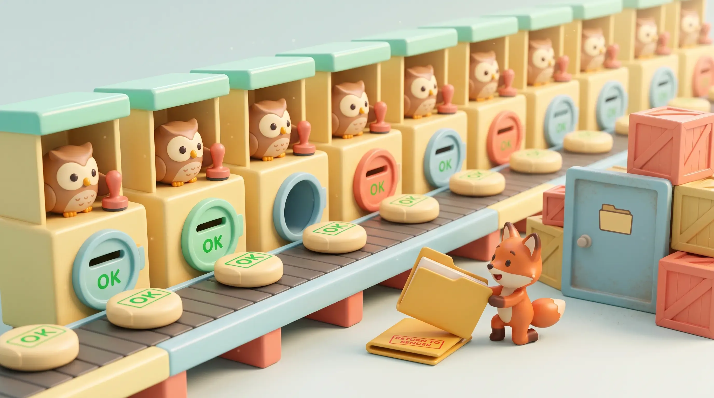

### Nueve tareas, nueve revisiones aprobadas, y una carpeta que a nadie se le ocurrió soltar.

*por Camilo — 19 de septiembre de 2026 · [LinkedIn](https://www.linkedin.com/in/ernestocamilovera/)*

Con el modo oscuro activado, el code-reviewer pasa el mouse sobre la fila resaltada del panel lateral de md-view. No está leyendo el CSS. Está leyendo lo que la aplicación real, ya compilada, efectivamente pinta en pantalla en ese pixel — `getComputedStyle()`, ejecutado contra el build empaquetado, no contra la intención del código.

Si venís siguiendo esta serie, ya conocés al elenco: el Lead, el full-stack-engineer, el code-reviewer, y el principio que bautizamos en la [primera entrega](https://technical-blog-6xs.pages.dev/my-articles/post-1-md-view-the-story/) — "Verify, don't restate". Esta es la cuarta parada, y es la que más lo pone a prueba a ese principio. Porque en el espacio de dos tareas consecutivas, el mismo sistema de revisión hace dos cosas casi opuestas: en una, atrapa un bug real que nadie más había visto. En la siguiente, deja pasar uno — después de que otras ocho tareas ya lo habían dejado pasar antes.

## Cuando el proceso se pone a prueba a sí mismo

La Task 24 cerraba un arco de tres partes: el panel lateral de archivos, que había arrancado como un árbol lazy con caché (Task 21) y sumado resize por arrastre (Task 23), ahora también debía expandirse automáticamente y resaltar el archivo activo cada vez que cambiara. Un detalle de UX, en apariencia menor.

La especificación, aprobada por el Lead antes de delegar el trabajo, era explícita en un punto: la fila resaltada necesitaba su propia regla de `dark-mode`, siguiendo la misma convención que ya usaba cada otro selector del panel. El engineer que implementó la feature decidió que no hacía falta — un solo acento en rgba, razonó, "se lee bien en los dos temas" — y lo dejó anotado como una desviación consciente, no oculta.

El reviewer no le tomó la palabra. Levantó la aplicación real, activó el modo oscuro, pasó el mouse sobre la fila activa, y midió. El resultado: en modo claro, la fila activa y una fila cualquiera al pasar el mouse se distinguían sin problema. En modo oscuro, se volvían literalmente el mismo color — el fondo de la fila activa colapsaba exactamente sobre el fondo de una fila cualquiera con hover, porque una regla `body.dark-mode .tree-row:hover` preexistente tenía más especificidad CSS que la nueva. La señal principal que se suponía debía distinguir "este es el archivo que estás viendo" de "esto es lo que tenés el mouse encima" — desaparecía, justo en el escenario donde más se necesitaba.

El hallazgo bloqueó la entrega. Se corrigió con dos reglas CSS más, ordenadas para ganar el empate de especificidad, y el reviewer volvió a medir — esta vez con un azul distinguible en ambos estados. Ningún test automatizado del suite afirma nada sobre el color calculado de esa fila; la única razón por la que el bug no llegó a producción es que alguien decidió no confiar en el argumento y fue a mirar la pantalla de verdad.

Es, en pocas palabras, el principio del proyecto funcionando exactamente como estaba diseñado.

## La carpeta que nadie soltó

Una tarea después, el mismo tipo de verificación empírica — pero esta vez hecha por mí, no por un reviewer, y sobre el build empaquetado, no sobre el código — encuentra algo mucho más incómodo.

md-view permite arrastrar un archivo Markdown a la ventana para abrirlo. Ese comportamiento — junto con el click en el panel lateral — pasa por un único punto de entrada compartido: el listener `REQUEST_OPEN_FILE`. Arrastrar una *carpeta*, en cambio, entraba por el mismo camino y terminaba en el mismo lugar que un archivo inválido: un mensaje de error, "no es un archivo Markdown". Lo llamativo no es que fallara — es que ya existía, desde hacía varias tareas, una función que sabía exactamente qué hacer con una carpeta (`establishTreeRoot`, la misma que usa el menú "Open Folder…"). El listener simplemente nunca le preguntaba al sistema operativo qué tipo de cosa acababa de recibir antes de decidir qué hacer con ella.

La corrección terminó siendo mínima: una sola llamada a `fs.stat` antes del resto de la lógica, para clasificar el path como carpeta o archivo antes de decidir. Lo que importa no es el tamaño del fix. Es cuánto tiempo estuvo el agujero ahí, sin que nadie lo viera.

Ese mismo listener había sido tocado, extendido o reutilizado en la Task 16 (donde nació el drag-and-drop), las Tasks 17 y 18 (donde se construyó `establishTreeRoot`), las Tasks 20 y 21 (donde el panel lateral sumó un segundo llamador al mismo listener) — y en cada una de las tareas siguientes, incluida la 24 que acabamos de contar. Nueve tareas. Nueve revisiones independientes, cada una con su propio reviewer leyendo diffs, corriendo el suite completo, verificando guardrails uno por uno. Todas aprobadas.

Ninguna encontró esto. Y no porque nadie mirara con cuidado — la Task 24, dos párrafos atrás, es prueba de lo contrario. La razón es más incómoda que "faltó rigor": el suite de tests end-to-end para drag-and-drop, por construcción, nunca soltó una carpeta. Cada fixture de esas pruebas es un archivo real, porque eso es literalmente lo que la feature se escribió para manejar el día que se creó. Un test suite no puede fallar una prueba que nadie escribió — y nueve revisiones que corren ese mismo suite, una y otra vez, tampoco pueden atrapar algo que el suite nunca estuvo diseñado para preguntar.

## Lo que nueve reviews en verde realmente prueban

Puestos uno al lado del otro, estos dos hallazgos separan dos categorías de falla que suelen confundirse bajo la misma palabra: "bug que pasó el review".

La Task 24 es un caso de verificación: alguien afirmó algo ("esto se ve bien en los dos temas") y el proceso, en vez de aceptarlo, lo puso a prueba contra la realidad. Ese tipo de falla se corrige con más disciplina de revisión — exactamente la que ya existía.

La Task 25 es un caso distinto: nadie afirmó nada falso. El spec, el código y el suite de tests eran, cada uno por separado, internamente consistentes y correctos respecto de lo que decían cubrir. El agujero no estaba en ningún afirmación que alguien hubiera hecho — estaba en una pregunta que nadie había hecho todavía. Revisar con más cuidado el mismo código, contra el mismo suite, no iba a encontrar eso. Hacía falta alguien usando la aplicación empaquetada de una forma que el diseño original de las pruebas nunca imaginó.

Nueve revisiones en verde no significan "no hay bugs". Significan "no hay bugs de los que sabíamos preguntar". Es una garantía real — y su límite es exactamente ese: los tests son tan buenos como las preguntas que alguien pensó en escribir. La disciplina de proceso reduce muchísimo el primer tipo de riesgo. El segundo tipo solo se reduce ampliando, de tanto en tanto, quién prueba qué y cómo — alguien arrastrando algo raro a una ventana real, en vez de confiar en que el catálogo de fixtures ya vio todo lo que hacía falta ver.

Y esto no es una particularidad de que acá quien revise sea, en parte, un agente de IA. Da lo mismo si el código lo escribe una persona, un agente generativo, o —como en este proyecto— un híbrido de ambos: los fundamentos no cambiaron. La misma experiencia y las mismas bases que hacían falta antes de que existiera un LLM siguen haciendo falta ahora, y siguen encontrando lo mismo de siempre — cosas que solo aparecen iterando, rompiendo el camino que el diseño original ya había trazado. Vale para una app de escritorio como esta, y vale igual para infraestructura o para cualquier automatización que dependa de software. Cambió quién escribe la línea y quién corre el test. No cambió la necesidad de que, cada tanto, alguien se salga del camino establecido.