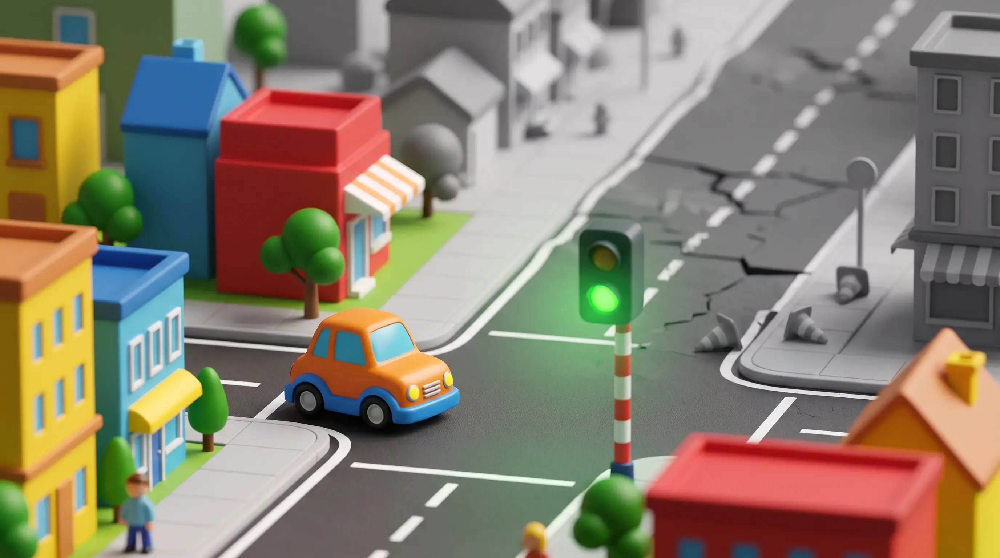

### Una decisión de arquitectura prolijamente documentada invalidó en silencio dos features que no tenían nada que ver entre sí — y encontrarlo a tiempo no fue cuestión de suerte.

*por Camilo — 2026-09-20 · [LinkedIn](https://www.linkedin.com/in/ernestocamilovera/)*

## Una línea de código, dos decisiones cuidadas

Task 29 era, en apariencia, un cambio cosmético: sacarle el chrome nativo del sistema operativo a la ventana principal de md-view y dibujar mi propia title bar — tres etiquetas de menú (File/View/Help), una zona de arrastre, y los tres controles de ventana de siempre. En Electron, eso empieza con una sola propiedad: `frame: false` en las opciones del `BrowserWindow`.

El problema es que esa línea nunca es tan inocente como parece. `defaultWindowOptions`, en `windowConfig.ts`, es un objeto compartido entre la ventana principal y la ventana de Help que introdujo Task 14 — y la de Help tiene, a propósito, una postura más simple y más estricta (sin preload, sin menú de aplicación). Agregar `frame: false` ahí adentro le hubiera apagado el chrome nativo a las dos ventanas sin que nadie lo pidiera para la segunda.

La decisión, registrada en ADR-005, fue quirúrgica: `frame: false` se agrega únicamente dentro de las opciones propias de `createWindow()`, apilado sobre el spread de `...defaultWindowOptions` exactamente como ya convivían `icon` y `preload`. `windowConfig.ts` y `menu.ts` terminan la tarea con diff cero — confirmado, no asumido.

La segunda decisión fue igual de cuidada. Las tres etiquetas de la title bar necesitan mostrar un menú real al hacer clic. La tentación obvia es describir el contenido de File/View/Help una segunda vez, en el renderer o en alguna estructura nueva pensada solo para el popup — y eso crea exactamente la trampa de las dos fuentes de verdad que este proyecto viene evitando desde Task 7. En cambio, un nuevo handler de IPC (`POPUP_MENU`) llama a la misma función `buildMenuTemplate()` que ya arma el menú nativo de la aplicación, saca la porción correspondiente a la sección clickeada, y la muestra como popup. Un solo lugar para describir el contenido del menú; cero diff en `menu.ts`.

Todo cerró limpio: 84 tests e2e en verde, y una fault injection ejecutada a mano por el reviewer sobre la prueba más crítica del task (FI-1: comentar los listeners que sincronizan el ícono de maximizar/restaurar con el estado real de la ventana, reconstruir, confirmar RED, restaurar, confirmar GREEN de nuevo). Difícil pedir un cierre de tarea más prolijo que este.

## El chrome que se fue con el documento

Pocos días después llegó Task 30. En un documento lo suficientemente largo como para forzar un scroll real, la title bar desaparecía de la pantalla — arrastrando con ella a los seis elementos interactivos que vive ahí adentro.

La causa, una vez encontrada, es de una simplicidad casi ofensiva: cada otro elemento de chrome fijo en la app (`#tree-panel`, `#tree-resize-handle`, `#status-bar`) había nacido con `position: fixed` desde el mismo task que lo introdujo. `#title-bar` fue el único que quedó en su valor por defecto, `position: static`, viviendo en el flujo normal del documento como primer hijo de `body` — y `body` es el elemento que scrollea desde Task 12, a propósito. La suite de Task 29, con sus 11 tests en verde, nunca abrió un documento lo bastante largo como para forzar ese scroll antes de medir la geometría de la title bar.

El fix real necesitó dos cambios, no uno: `#title-bar { position: fixed; top: 0; left: 0; right: 0; z-index: 10; }`, más una compensación en `#app-body { margin-top: var(--title-bar-height); }`, reutilizando la misma variable de 2rem definida desde Task 29. Sacar la title bar del flujo normal le quita a `#app-body` el empuje hacia abajo que antes recibía gratis por la altura de la title bar en flujo — sin ese `margin-top` explícito, el contenido se desliza hacia arriba y queda *detrás* de la title bar en vez de debajo.

Hay un detalle que vale la pena señalar porque es más honesto que una anécdota prolija: el propio review de Task 29 ya había olfateado algo en este barrio exacto. Su Should-fix S-1 señalaba que no existía una prueba e2e directa de que `#tree-panel` no se superpusiera con la nueva title bar de 2rem de alto. Estaba mirando en la dirección correcta y aun así no vio venir el bug real — que no era de superposición estática, sino de comportamiento bajo scroll. Ni una revisión cuidadosa predice la forma exacta de una regresión en cascada.

El reviewer de Task 30 tampoco se conformó con la narrativa del DEVLOG. Ese documento afirmaba que "3 de los 6 tests nuevos daban RED antes del fix". El reviewer revirtió solo el CSS, corrió la suite de nuevo, y encontró que en realidad solo 2 de los 6 fallaban contra el CSS revertido — el tercer "RED" que el DEVLOG contaba pertenecía a un borrador anterior de un test que después fue reemplazado por una versión distinta. Un error chico, real, y corregido en el propio DEVLOG en el mismo ciclo. Con el fix aplicado: 17/17 en `window-chrome.spec.ts`, 31/31 en `tree-panel.spec.ts`.

## El bug que nunca fue de z-index

Pero el problema no estaba resuelto del todo. Con la title bar ya fija en su lugar, el scrollbar nativo del sistema operativo seguía atravesando visualmente por detrás del chrome custom, justo en la franja donde debería estar la title bar — un documento largo seguía desbordando `body`, y `body` seguía siendo el elemento que scrollea.

Vale la pena detenerse acá porque es el momento más interesante de los tres tasks. La tentación inmediata es pensar "problema de z-index, subo el `z-index` de la title bar un poco más" — y eso nunca iba a funcionar, ni en principio. Un scrollbar nativo se pinta en la capa del compositor del navegador o del sistema operativo, una capa que vive estructuralmente *afuera* del stacking context del DOM de la página. Ninguna propiedad CSS de ningún elemento puede alcanzar esa capa y hacerla respetar nada. El bug nunca fue "qué elemento pinta encima de cuál" — era "qué elemento está scrolleando, para empezar". Y esa es una pregunta que hay que resolver relocalizando el scroll, no repintando alrededor de él.

La solución no inventó nada: `#tree-panel` ya había resuelto exactamente esta clase de problema para sí mismo en Task 26, con `position: fixed`, una altura acotada, y su propio `overflow-y: auto`, de modo que su scrollbar queda contenido dentro de su propia caja en vez de abarcar todo el viewport. Task 31 extiende el mismo patrón, ya probado, a `#main-panel`:

```css
#main-panel {
  position: fixed;
  top: var(--title-bar-height);
  left: var(--tree-panel-width);
  right: 0;
  bottom: 2rem;
  overflow-y: auto;
}
```

El reviewer no aceptó la afirmación de contención de scrollbar por comentario de código: revirtió solo esta regla base, reconstruyó, y midió `mainPanelRect.bottom = 18372.4` — miles de píxeles más allá de la altura real del viewport. Ese número coincide, al píxel, con la misma medición que el engineer ya había reportado de forma independiente en su propio DEVLOG. Esa clase de coincidencia exacta entre dos mediciones hechas por separado vale más que cualquiera de los dos reportes por sí solo.

## Lo que faltaba después de arreglarlo

Convertir `#main-panel` a `position: fixed` trajo dos efectos colaterales que ningún pattern-matching por analogía iba a anticipar — y los dos se encontraron corriendo la suite completa, no razonando sobre el diff.

El primero: la regla `body.tree-panel-hidden #main-panel { margin-left: 0; }` de Task 28 dependía de que `#main-panel` siguiera usando `margin-left` para su offset horizontal. Si la regla base pasaba a usar `left` sin convertir también el override, este se volvía código muerto en el instante en que se aplicaba el fix — ocultar el tree panel dejaría a `#main-panel` desplazado para siempre por el ancho fantasma del panel. Se verificó revirtiendo solo esa línea: el test correspondiente daba RED con `left` recibiendo 260 (el ancho del tree panel) en vez de 0. Restaurada, volvía a dar GREEN.

El segundo fue más sutil. `#tree-resize-handle` vive en el mismo `left: var(--tree-panel-width)` que el nuevo borde izquierdo de `#main-panel`. Antes de este task, `#main-panel` no estaba posicionado, así que pintaba por debajo de cualquier elemento posicionado sin importar el orden del DOM, y `#tree-resize-handle` (fijo desde Task 26) siempre ganaba el orden de pintado gratis. En el instante en que `#main-panel` también pasó a `position: fixed`, ambos comparten el mismo nivel implícito de stacking, y los empates se resuelven por orden del DOM — `#main-panel` viene después del handle en `index.html`, así que empezó a pintar encima y a interceptar en silencio su zona de agarre de 6px. Los cinco tests de drag-to-resize de Task 23 fallaron de forma determinística apenas se aplicó la regla base, antes incluso de que se agregara el fix complementario. La solución fue un simple `z-index: 1` en `#tree-resize-handle` — y el reviewer no lo dio por bueno leyendo el comentario: quitó esa línea, confirmó que 5 de 6 tests de Task 23 volvían a fallar por la razón exacta reclamada, la restauró, y confirmó verde otra vez.

## Verde no es lo mismo que correcto

El engineer mismo encontró, corriendo la suite completa después de aplicar el fix de Task 31, dos regresiones más fuera del scope original: un test de `tree-panel.spec.ts` y otro de `view-menu.spec.ts` seguían asumiendo la semántica anterior de `window.scrollY` y `marginLeft` que este fix acababa de retirar. En vez de rodear el problema, lo reportó y esperó a que el scope se ampliara formalmente antes de tocar esos archivos — el mismo camino de escalamiento que ya había quedado establecido como precedente en Task 29. La regresión final, con los dos archivos ya en scope, cerró en 93 tests e2e, 99 unitarios y 19 de integración, todos en verde.

La decisión de hacer `frame: false` en Task 29 no fue el problema. Estuvo bien pensada, bien acotada, y bien probada — ADR-005 lo documenta con un nivel de cuidado que cualquiera envidiaría. Lo que falló fue un supuesto de tres tasks atrás y dos features de distancia, invisible desde la spec del propio Task 29: que siempre iba a existir chrome fijo por encima del contenido scrolleable, un supuesto que Task 12 nunca tuvo motivo para cuestionar porque en ese momento era cierto.

Ninguna revisión de spec iba a atrapar eso. Lo que sí lo atrapó fue correr la suite completa después de cada cambio, tomarse en serio hasta los resultados que nadie esperaba, y — cuando algo fallaba — no conformarse con la explicación más cómoda hasta reproducirla con las propias manos. El objetivo de una gobernanza como esta no es predecir cada regresión en cascada antes de que pase. Es garantizar que cuando aparezca — porque va a aparecer — quede probada y explicada, no simplemente asumida.